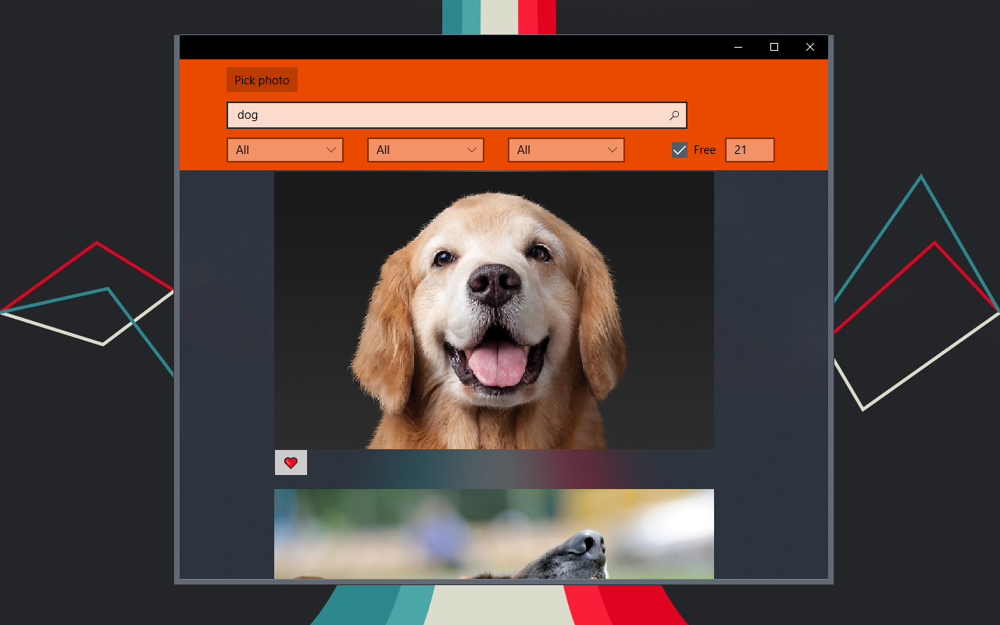

# Krooch
Bing Images client with original features

## What does it use?
  - UWP
  - Bing Search API V7
  - Computer Vision API
  - Realm

## Why this project ?
Interested in UWP, I tried to make a first app with original features.

## To do
- [X] Search images
- [X] Add filters
- [X] Home page with favorites pictures (double tap to like/unlike)
- [X] Persistence
- [X] Search text from a picture
- [X] Acrylic effect in background (fluent design, creators update)
- [ ] Pretty interface for pictures (+ scaling of images)
- [ ] Download pictures button
- [ ] Search with voice command

## Can I help you?
Of course ! By trying to do the tasks of the todo section, by giving advices or by hitting the :star: button !
